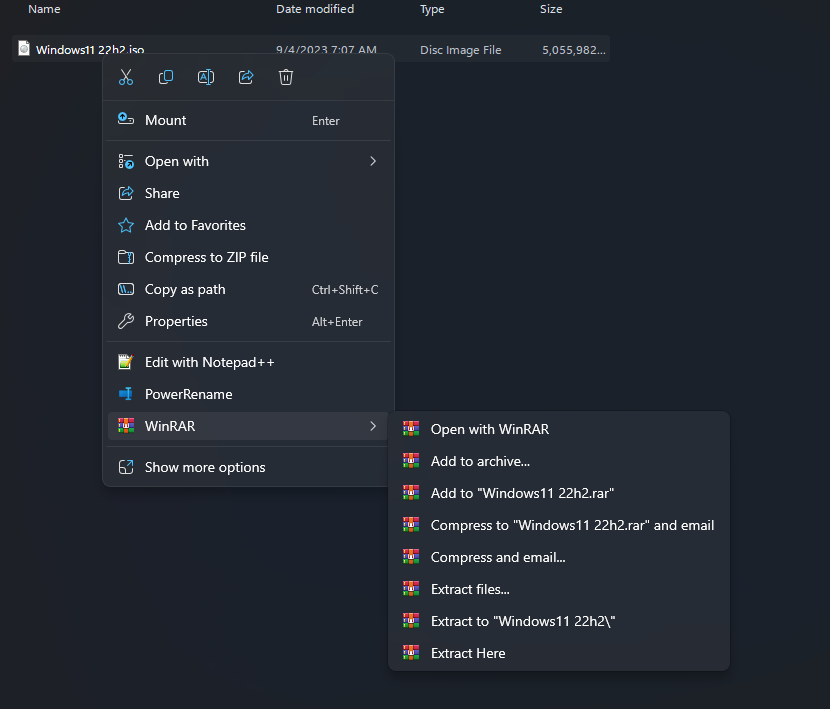
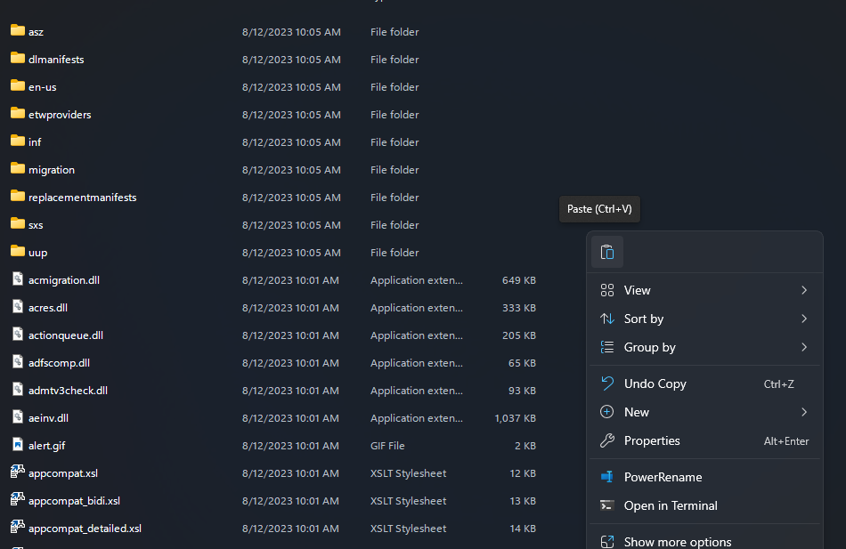

 

  

  <h1 align="center">Fix-Error-This-PC-Can-t-Run-Windows-11</h3>

  

    Fix Error This PC Can't Run Windows 11 when upgrading from iso setup.exe by simply replacing a dll file
  
  

## Get Started
1. Download the <a href="appraiserres.dll">appraiserres.dll</a>.
2. Extract the iso

3. Copy the downloaded <a href="appraiserres.dll">appraiserres.dll</a>.

4. Go into the extacted iso folder

5. Inside the iso folder go into the "sources" folder.

6. Paste the copied <a href="appraiserres.dll">appraiserres.dll</a> file

7. Click "Replace the file in the destination"

8.Run "setup.exe" in the extracted iso folder and continue normally.
  

<h1>Enjoy</h1>

